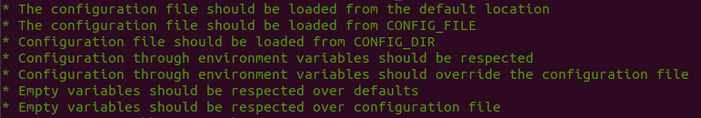
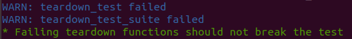
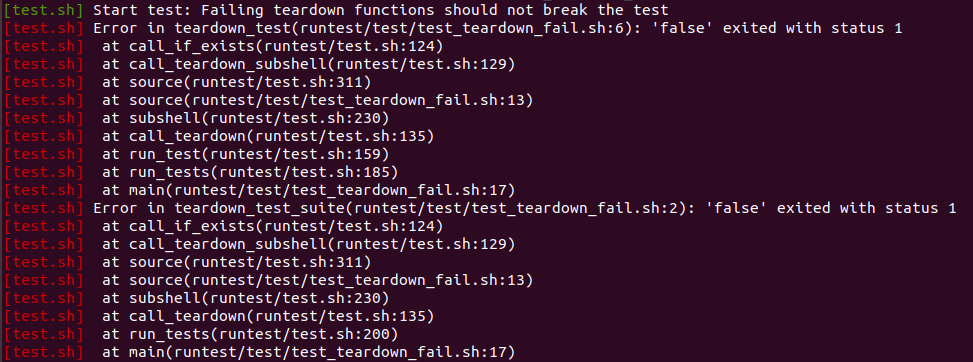


Latest stable version: [{{ site.stable_version }}](releases/v{{ site.stable_version }})


Latest development version: [{{ site.unstable_version }}](releases/latest/)

[All releases](releases/)

# What is **test.sh**?

Consider this:

>You start to write some tests as shell scripts. Then you start considering cleaning
the output to get a clear view of the result but without loosing the output produced
by the test. After some failed runs you decide to implement some kind of error reporting
because it's not easy to find the command that failed. Now you have a bunch of tests and
you may want to formalize the setup and teardown of each test and the script itself.
Then you may like to execute all the tests in the script even when some of them fail.
As you use `set -o errexit` for implicit assertions, you consider running each test in a
subshell, but then you realize that you've lost track of source file and line. Things start
to get more complicated. You don't want
to repeat all this code in every test: it's hard to maintain and it obscures the test code,
>which is hidden by all the framework code.
So you take all the common code and put it in a file that is sourced from every test script:
now you have a shell script library for writing tests. This is what **test.sh** is.

This is what a test looks like:

```bash
#!/bin/bash
source "$(dirname "$(readlink -f "$BASH_SOURCE")")"/test.sh

set_test_name "This is my first test"
assert_true true

set_test_name "This is my second test"
assert_true false
```

The previous test was written in *inline* mode. You can also choose *managed* mode, and the test would become:

```bash
#!/bin/bash
test_01() {
  test_name "This is my first test"
  assert_true true
}

test_02() {
  test_name "This is my second test"
  assert_true false
}

source "$(dirname "$(readlink -f "$BASH_SOURCE")")"/test.sh

run_tests
```

In _managed_ mode you write each test in a separate function and then invoke `run_tests` to run your tests.

In _inline_ mode you don't invoke `run_tests`; just remember to call `start_test` to provide context.

# What does **test.sh** provide?

With **test.sh** you get:

* **Colorized summary output**.

  

* **Separate log output or displayed along the main output**. Each run is logged to a well-defined
location.
* **Detailed error reporting**. What failed and where, with a stack trace.

  

* **Setup/Teardown functions**. `setup_test_suite` and `teardown_test_suite` will be called
only once at the start and end of the script. `setup_test` and `teardown_test` will be called
before and after each test in the script. Failures in `teardown_*` functions don't fail the test
but produce an error trace in the log file and a warning in the main output.

  Sample main output of a test with failing teardown functions:

  

  Sample log output of the same test:

  

* **Include shared code among your tests**. Place shared code in a predefined location and it will be automatically
sourced in your script.
* **Test function discovery**. In managed mode, add a function starting with `test_` and it will be executed
automatically.
* **Stop at the first failure or run all the tests** in the script even if some or all fail. Only in managed mode.
* **Library configuration**. Things such as the pattern of test function names or the location
of included code, if you want different settings than the default ones.

**test.sh** is for single test scripts; it does not run your collection of test scripts. You can use
[Makefile.test](https://github.com/box/Makefile.test) for
that purpose. Or simply:

```bash
find test -name test\*.sh | while read test; do ""$test""; done
```
